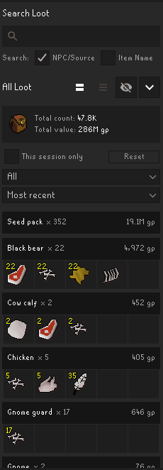

# Loot Tracker Extended

Loot Tracker Extended is a RuneLite side-panel plugin that builds on the functionality of the Loot Tracker plugin by adding search, filtering, longer history retention, session analysis, and optional OSRS Wiki drop rates.

RuneLite's built-in **Loot Tracker must be enabled** because it produces the loot events that Extended consumes. Loot Tracker Extended then stores and manages its own copy of that data.

**Loot Tracker Extended operates independently of Loot Tracker's saved history.** It performs a one-time import for each RuneScape profile, then tracks new loot in its own separate file. Resetting or changing Extended history **never** modifies the built-in Loot Tracker's records, and resetting Loot Tracker does not reset Extended's.

## Functionality

Extended mirrors the core parts of the standard Loot Tracker experience. The display and shared preferences are intentionally familiar, but the two plugins manage loot histories independently.

Some additional features in Loot Tracker Extended are:

### Searching and filtering

- Search by either **NPC/Source** or **Item Name**.
- Item searches remain grouped by the NPC or activity that produced each matching drop.
- Total GP value updates dynamically to describe only the current search and filter results.
- Filter by source type: NPC, activity, pickpocket, player, other, or all.
- Sort by most recent, least recent, or alphabetical order.

### OSRS Wiki drop rates

Wiki drop-rate tooltips are disabled by default and must be enabled explicitly in the plugin settings.

When enabled, hovering a loot item requests the corresponding source's drop rate from the relevant NPC via `oldschool.runescape.wiki`. The plugin does not send RuneScape account credentials, player names, or loot history.

A right-click action opens the relevant Wiki source page for loot where the lookup failed or has variable drop rates.

### Session loot

**This session only** limits the panel to loot received since the current session began. It supports two views:

- **Grouped by source:** shows session totals for each source and can expand one source into its individual kills or reward rolls.
- **Individual loot:** shows a chronological per-kill or per-reward breakdown across every session source.

### Extended history limits

By default, Loot Tracker Extended loads its saved data using Loot Tracker's standard history window. Enabling **Extended loot history** provides configurable limits:

- **History age (days):** controls the oldest history loaded; `0` means unlimited age.
- **Maximum drop entries:** controls the number of distinct stored item entries loaded; `0` means unlimited entries.

Retention limits affect what is loaded and displayed, not what is deleted. If a hidden source produces new loot, Extended merges the new event into its complete persisted aggregate before saving it.

Loot received while Extended is disabled is not automatically added to its existing history when it is enabled again. A manual re-import can recover whatever data is still present in Loot Tracker, but it replaces the current Extended copy.

**Re-import Loot Tracker history** deletes the active profile's current Extended history and replaces it with the history still available in Loot Tracker.

## License

Loot Tracker Extended is available under the BSD 2-Clause License. See [LICENSE](LICENSE).

Third-party artwork and attribution are documented in
[THIRD_PARTY_NOTICES.md](THIRD_PARTY_NOTICES.md).
