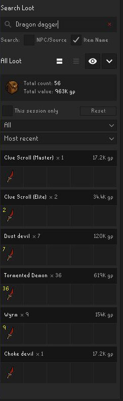
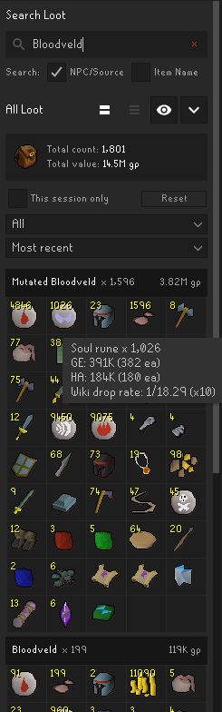
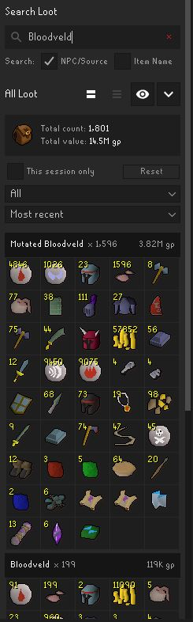

# Loot Tracker Extended

Loot Tracker Extended is a side-panel plugin that builds on the functionality of the built-in Loot Tracker plugin.

**Loot Tracker must be enabled** for this plugin to work.

Resetting or changing Extended's loot history will **never** modify the built-in Loot Tracker's records.

## Functionality

The standard Loot Tracker experience plus:

### Searching and Filtering

- Search by either **NPC/Source** or **Item Name**.
- Filter by source type: NPC, activity, pickpocket, player, other, or all (default).
- Optionally limit to current-session loot via **This session only**

### Wiki Drop Rates

- Enable **Wiki drop rates**
- Hovering a loot item fetches the drop rates from `oldschool.runescape.wiki`.
  - The plugin does not send RuneScape account credentials, player names, or loot history.
- Right-click to open the full Wiki source page.

### Extended History

Enable **Extended loot history** to configure limits:

- **History age (days):** controls the oldest history loaded ( `0` for unlimited, Loot Tracker default is `365`).
- **Maximum drop entries:** controls the number of distinct stored item entries loaded (`0` for unlimited, Loot Tracker default is `1024`).

Use **Re-import Loot Tracker history** to overwrite stale Extended data (e.g. you disabled the plugin for a while) with a fresh copy from Loot Tracker.

  
  
  

## License

Loot Tracker Extended is available under the BSD 2-Clause License. See [LICENSE](LICENSE).

Third-party artwork and attribution are documented in
[THIRD_PARTY_NOTICES.md](THIRD_PARTY_NOTICES.md).
